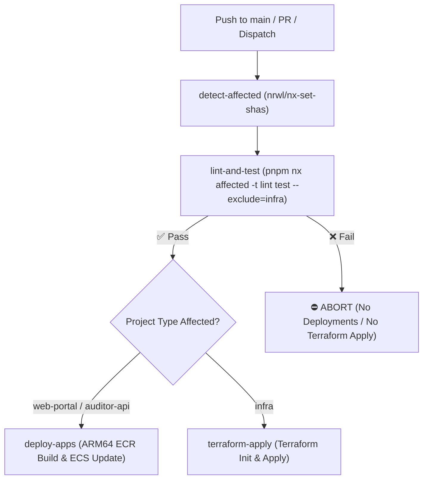

# CloudPulse

CloudPulse is a cloud telemetry and remediation platform built with a Next.js web portal (`web-portal`), a NestJS auditor backend (`auditor-api`), shared contract libraries, and Terraform infrastructure management (`infra`).

---

## 🚀 GitHub Actions CI/CD Pipelines

CloudPulse utilizes a unified, automated CI/CD architecture powered by **Nx affected dependency graph detection** across both application software and Terraform infrastructure.

### Workflow Execution Flow



---

### Key Workflows

1. **Application Deployments Workflow ([`.github/workflows/app-deploy.yml`](.github/workflows/app-deploy.yml))**:
   - **Trigger**: Push to `main` or manual `workflow_dispatch`.
   - **Nx Affected Detection**: Uses `nrwl/nx-set-shas@v4` and `pnpm nx show projects --affected` to inspect git diffs and identify affected components (`web-portal`, `auditor-api`, `api-contracts`, `gitflow`).
   - **Quality Gate**: Runs `pnpm nx affected -t lint test --exclude=infra` in the `lint-and-test` job. If any unit test or lint check fails, deployment is aborted immediately.
   - **Container Build & Deploy**: Builds `linux/arm64` container images via Docker Buildx & QEMU, tags images with `:latest` and `:${{ github.sha }}`, pushes to AWS ECR, and triggers `aws ecs update-service --force-new-deployment` for rolling updates.

2. **PR Validation Workflow ([`.github/workflows/app-pr-test.yml`](.github/workflows/app-pr-test.yml))**:
   - **Trigger**: Pull Request targeting `main`.
   - **Validation**: Executes `pnpm nx affected -t lint test --exclude=infra` and performs dry-run ARM64 Docker image compilations (`push: false`) to catch broken builds before merging.

3. **Infrastructure Workflows ([`.github/workflows/infra-main-apply.yml`](.github/workflows/infra-main-apply.yml) & [`.github/workflows/infra-pr-plan.yml`](.github/workflows/infra-pr-plan.yml))**:
   - **Trigger**: Pull Request or push to `main` modifying HCL files under `apps/infra`.
   - **Validation & Apply**: Checks HCL formatting (`terraform fmt -check`), validates Terraform modules (`terraform validate`), generates execution plans (`terraform plan`), and applies changes on `main` (`terraform apply`).

---

## 🛠️ Local Development & Testing Commands

To run tests and lint checks locally across affected or specific workspace projects:

```bash
# Install dependencies
pnpm install

# Run lint & unit tests across affected projects (excluding infra)
pnpm nx affected -t lint test --exclude=infra

# Run auditor API unit tests directly
pnpm run test-auditor-api

# Run web portal unit tests directly
pnpm run test-web-portal
```
